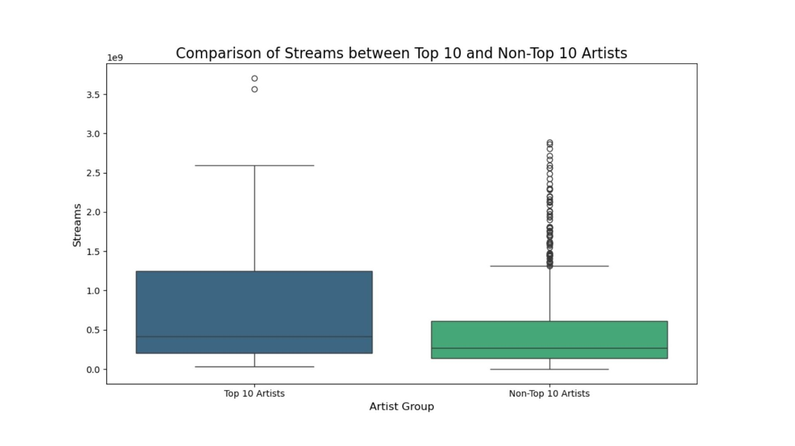
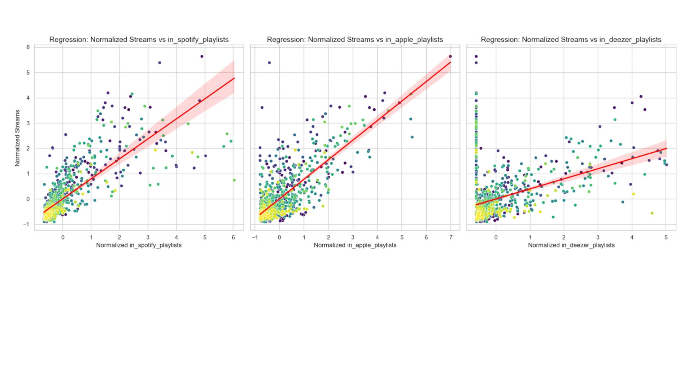
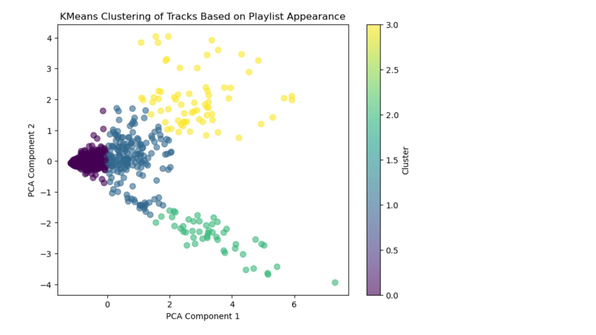
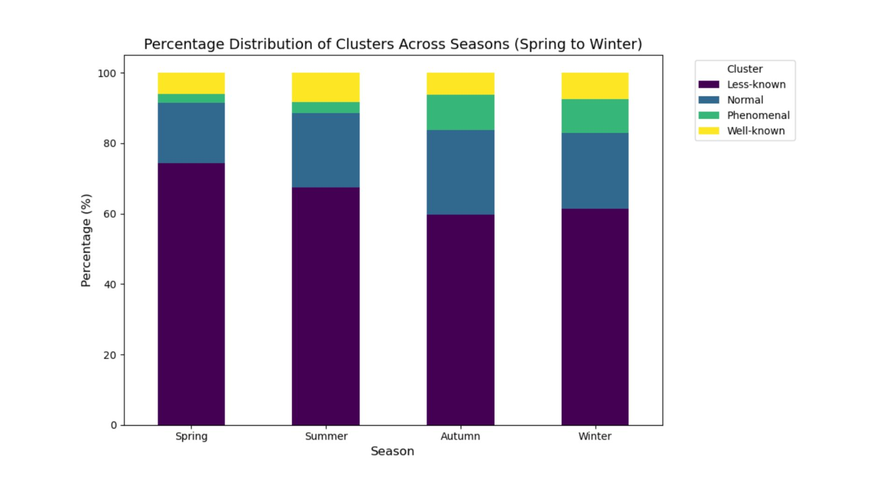

# Predicting the Next Hit
**Music Streaming · Content Performance Analysis**

## Overview
Analyzed Spotify's top songs of 2023 to identify factors most strongly associated with streaming success and inform data-driven music investment and release decisions.

> Full write-up available at [portfolio URL]

## Methods
- Exploratory Data Analysis
- Hypothesis Testing (t-tests, chi-square)
- Multiple Linear Regression
- K-Means Clustering
- PCA

## Key Findings
- **Playlist placement explained 72.7% of variance in streams** (R²=0.727) — Spotify placements had the largest effect (β=0.4975) vs Apple Music (β=0.37) and Deezer (β=0.12)
- **Audio features did not predict streaming performance** across the full dataset — danceability showed a slight negative correlation (r=−0.10) despite being common among top artists
- **Release season was significantly associated with performance tier** — top-performing songs were more concentrated in winter releases (χ²=27.92, p=.001)

## Tech Stack
Python · Pandas · Statsmodels · SciPy · Scikit-learn · Matplotlib · Seaborn

## Files
- `spotify_hit_analysis.py` — main analysis script
- `requirements.txt` — project dependencies

## Key Visual Insights

### Distribution of Streams

Top artists exhibit higher median streams and greater variability, with success driven by a small number of highly viral tracks.

### Playlist Impact on Streams

Streaming performance increases with playlist placements, with Spotify playlists showing the strongest influence.

### Actual vs Predicted Streams

Model predictions closely track actual values, indicating strong predictive performance with some variance in high-stream outliers.

### Track Clustering by Performance

Tracks cluster into distinct performance tiers based on playlist exposure, separating low-visibility tracks from high-performing hits.

### Performance by Release Season

Higher-performing tracks are more concentrated in certain seasons, supporting the role of release timing in success.

## How to Run
```bash
pip install -r requirements.txt
python spotify_hit_analysis.py
```

## Data
Dataset: [Top Spotify Songs 2023 — Kaggle](https://www.kaggle.com/datasets/nelgiriyewithana/top-spotify-songs-2023)
