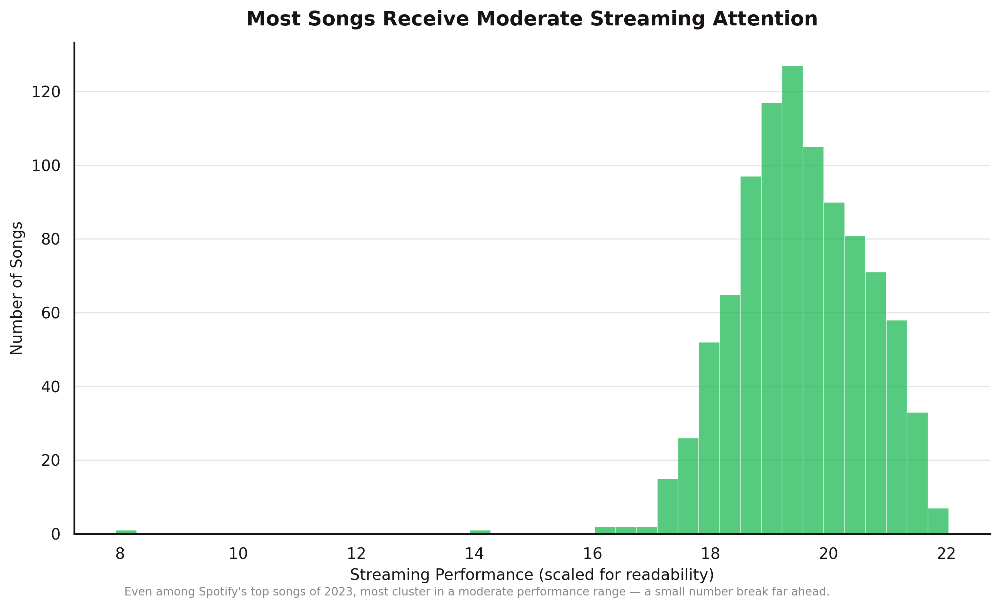
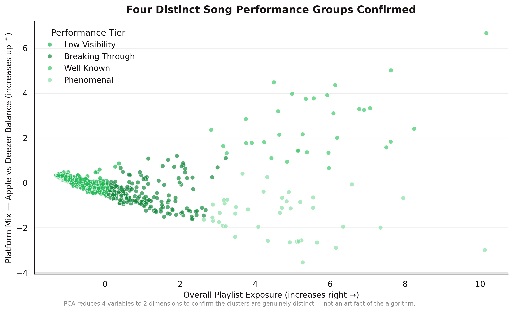
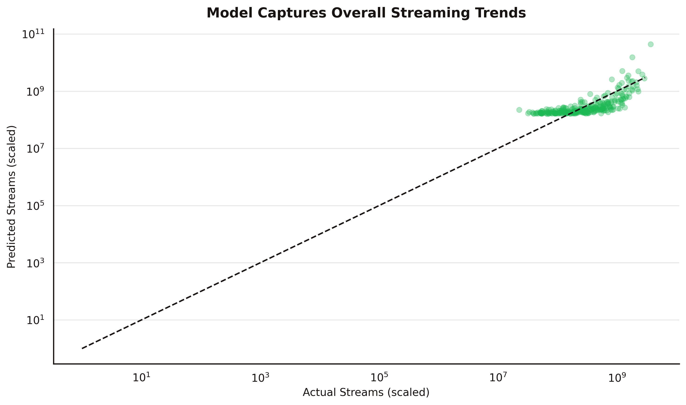
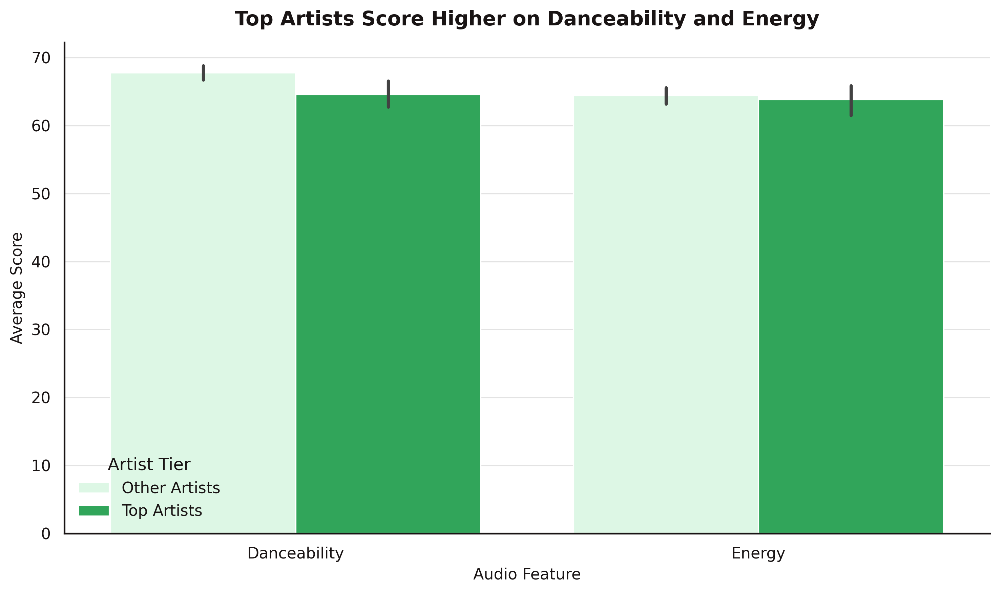

# Playlist Placement Beats Talent
**Multiple Linear Regression · K-Means Clustering · PCA · 953 Songs**

---

## Overview
The assumption was that audio features — danceability, energy, tempo — drive streaming success. The data said otherwise.

This project analyzes Spotify's top songs of 2023 to identify what actually predicts streaming performance across Spotify, Apple Music, and Deezer. Built a full pipeline from raw CSV to regression, clustering, and hypothesis testing.

> Full write-up available at [portfolio URL]

---

## Key Findings
- **Playlist placement explained 72.7% of variance in streams (R²=0.727)** — distribution is the lever, not the music itself
- **Spotify placements had the largest effect** vs Apple Music and Deezer — Spotify editorial is the single highest-leverage channel
- **Top artists show slightly higher danceability and energy** — but these features showed little to no predictive power across the full dataset
- **Release season is significantly associated with performance tier** — top-performing songs were more concentrated in winter releases (χ²=27.92, p=.001)

The practical takeaway: getting on the right playlists matters more than what the song sounds like.

---

## Key Visuals

### Most Songs Receive Moderate Streaming Attention


Even among Spotify's top songs of 2023, most cluster in a moderate performance range — a small number break far ahead.

### Spotify Playlists Have the Strongest Impact on Streams


Spotify editorial placement is the single highest-leverage distribution channel — Deezer shows no positive relationship with streams.

### Songs Group into Distinct Performance Tiers by Playlist Exposure


K-means clustering separates tracks into four tiers — Low Visibility, Breaking Through, Well Known, and Phenomenal — based on playlist presence and stream volume.

### Four Distinct Song Performance Groups Confirmed


PCA reduces 4 variables to 2 dimensions to confirm the clusters are genuinely distinct and not an artifact of the algorithm.

### Song Performance Mix Changes Across Release Seasons


Winter releases show the highest share of top-tier songs — release timing meaningfully affects a track's chance of breaking through.

### Model Captures Overall Streaming Trends (R²=0.727)


Predicted values track actual streams closely across most of the range — songs above the line outperformed what their playlist presence would predict.

### Top Artists Show Slightly Higher Danceability and Energy


Top artists trend higher on both features, but the gap is small and these traits don't predict success across the full dataset.

### Audio Features Have Near-Zero Correlation with Streams


None of the audio features meaningfully predict stream count — what a song sounds like is not what makes it perform well.

---

## Methods
- Exploratory Data Analysis
- Multiple Linear Regression with standardized coefficients for platform comparison
- T-tests comparing top vs non-top artist audio feature scores
- Chi-square test for release season vs performance tier
- K-Means Clustering (k=4) on playlist presence and stream volume
- PCA for cluster validation in reduced feature space

---

## Tech Stack
Python · Pandas · Statsmodels · SciPy · Scikit-learn · Matplotlib · Seaborn

---

## How to Run

```bash
pip install -r requirements.txt
jupyter notebook spotify-hit-song-analysis.ipynb
```

---

## Data

**Top Spotify Songs 2023:** https://www.kaggle.com/datasets/nelgiriyewithana/top-spotify-songs-2023

> Dataset not included in this repo due to size. Download from Kaggle and place the CSV in a folder called `spotify` in your Google Drive.

---

## Files
- `spotify-hit-song-analysis.ipynb` — full analysis notebook
- `requirements.txt` — dependencies
- `plots/` — generated visualizations
