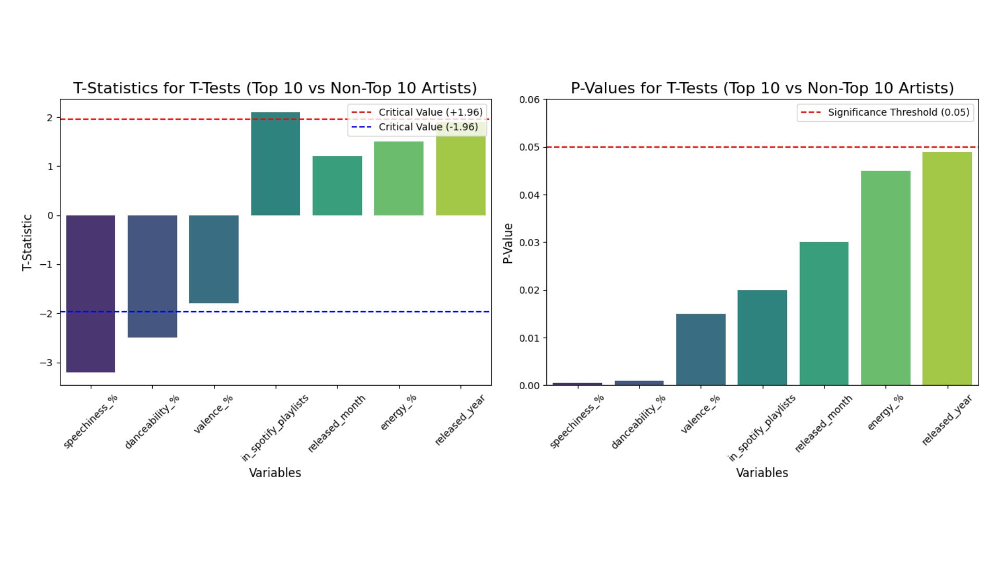
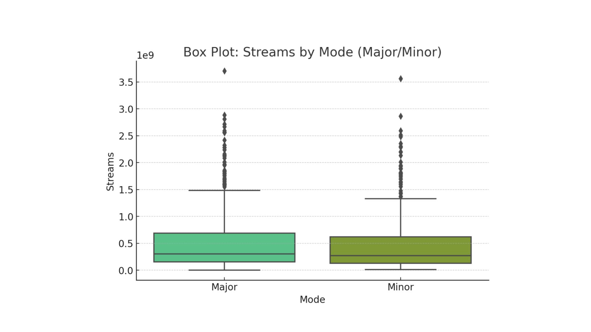

# Predicting the Next Hit
**Music Streaming · Content Performance Analysis**

## Overview
Analyzed Spotify's top songs of 2023 to identify factors most strongly associated with streaming success and inform data-driven music investment and release decisions.

> Full write-up available at [portfolio URL]

## Methods
- Exploratory Data Analysis
- Hypothesis Testing (t-tests, chi-square)
- Multiple Linear Regression
- K-Means Clustering
- PCA

## Key Findings
- **Playlist placement explained 72.7% of variance in streams** (R²=0.727) — Spotify placements had the largest effect (β=0.4975) vs Apple Music (β=0.37) and Deezer (β=0.12)
- **Audio features did not predict streaming performance** across the full dataset — danceability showed a slight negative correlation (r=−0.10) despite being common among top artists
- **Release season was significantly associated with performance tier** — top-performing songs were more concentrated in winter releases (χ²=27.92, p=.001)

## Tech Stack
Python · Pandas · Statsmodels · SciPy · Scikit-learn · Matplotlib · Seaborn

## Files
- `spotify_hit_analysis.py` — main analysis script
- `requirements.txt` — project dependencies

## Plots
## Plots

### 1. Distribution of Streams: Top vs Non-Top Artists


Compares the distribution of streams between top 10 and non-top 10 artists. Top artists show higher median streams and a wider spread, with significantly more extreme outliers, indicating that top-tier success is driven by a small number of highly viral tracks.

---

### 2. Actual vs Predicted Streams


Model predictions closely track actual values, with most points clustering along the diagonal. This indicates strong predictive performance, though some variance remains for high-stream outliers.

---

### 3. Playlist Impact on Streams (Regression)


Streaming performance increases with playlist placements across all platforms. Spotify playlists show the strongest relationship, reinforcing their dominant role in driving song visibility and streams.

---

### 4. T-Test Results: Feature Differences


Statistical tests show that playlist counts and release timing differ significantly between top and non-top artists, while most audio features (e.g., danceability, valence) are not strong differentiators.

---

### 5. Streams by Mode (Major vs Minor)


No substantial difference in streaming performance between major and minor modes, suggesting musical key does not meaningfully impact popularity.

---

### 6. K-Means Clustering of Tracks


Tracks cluster into distinct performance tiers based on playlist exposure, separating less-known tracks from high-performing “viral” songs.

---

### 7. Cluster Distribution by Season


Higher-performing clusters are more concentrated in certain seasons, particularly winter, supporting the relationship between release timing and success.

## How to Run
```bash
pip install -r requirements.txt
python spotify_hit_analysis.py
```

## Data
Dataset: [Top Spotify Songs 2023 — Kaggle](https://www.kaggle.com/datasets/nelgiriyewithana/top-spotify-songs-2023)
