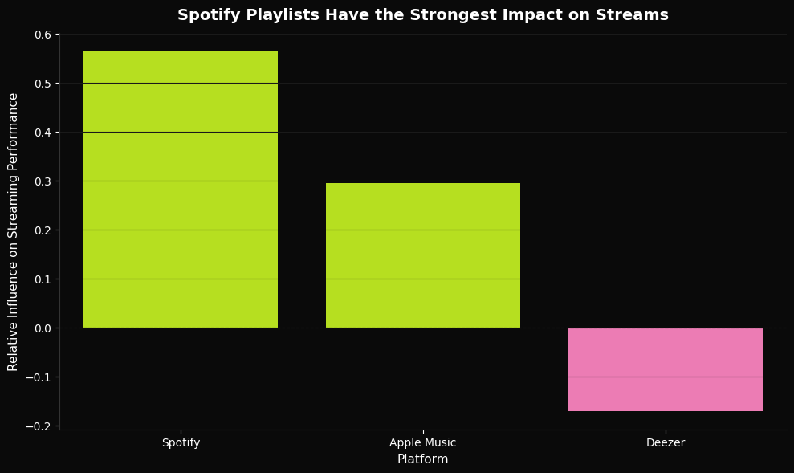
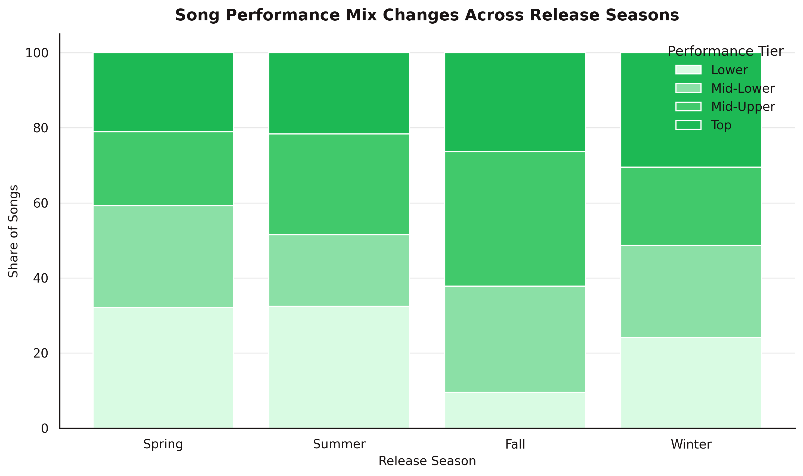
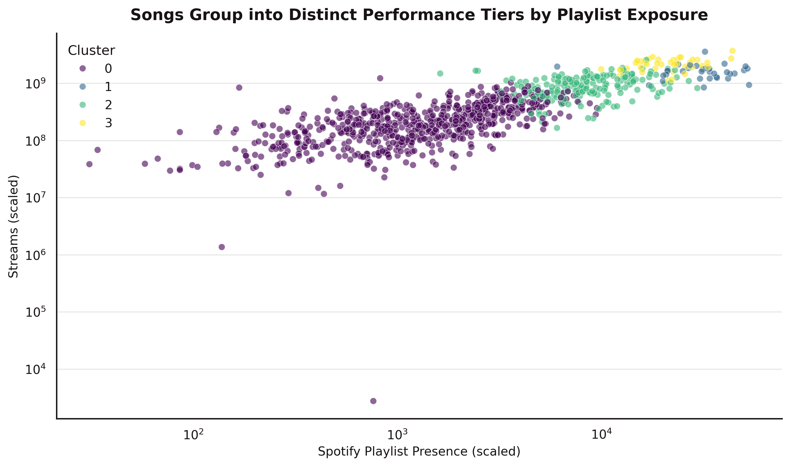
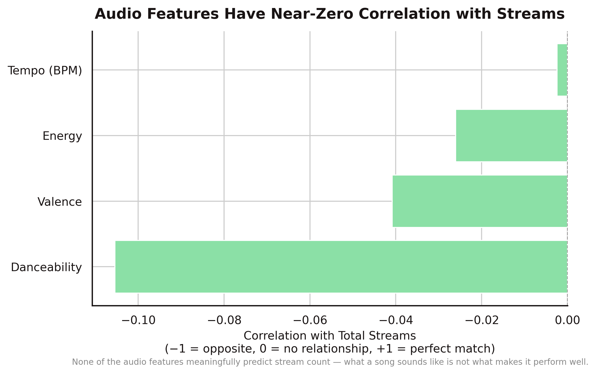

# What Actually Drives Streaming Performance?
**Multiple Linear Regression · K-Means Clustering · PCA · 952 Songs**

---

## Overview
Playlist placement, audio features, release timing — which actually predicts whether a song performs? This project analyzed Spotify's top songs of 2023 to find out, testing variables across Spotify, Apple Music, and Deezer.

Built a full pipeline from raw CSV to regression, clustering, and hypothesis testing.

> Full write-up: https://jasminebahremand.my.canva.site/

--- 

## Key Findings
- **Playlist placement explained 46.4% of variance in streams (R²=0.464)** — distribution is the lever, not the music itself
- **Spotify placements had the largest effect** (β=0.565) vs Apple Music (β=0.294) — Deezer showed a negative relationship (β=−0.171)
- **Audio features do not predict streaming success** — danceability showed a slight negative correlation (r=−0.11) and top artists did not consistently outscore others
- **Release season is significantly associated with performance tier** — winter releases showed the highest concentration of top-performing songs (χ²=55.40, p<.001)

---

## Key Visuals

### Spotify Playlists Have the Strongest Impact on Streams

Spotify editorial placement is the single highest-leverage distribution channel — Deezer shows a negative relationship with streams.

### Song Performance Mix Changes Across Release Seasons

Winter releases show the highest share of top-tier songs (χ²=55.40, p<.001) — release timing meaningfully affects a track's chance of breaking through.

### Songs Group into Distinct Performance Tiers by Playlist Exposure

K-means clustering separates tracks into four tiers — Low Visibility, Breaking Through, Well Known, and Phenomenal — based on playlist presence and stream volume.

### Audio Features Have Near-Zero Correlation with Streams

All audio features show weak to negative correlations with streams — what a song sounds like is not what makes it perform well.

---

## Methods
- Exploratory Data Analysis
- Multiple Linear Regression with standardized coefficients for platform comparison
- T-tests comparing top vs non-top artist audio feature scores
- Chi-square test for release season vs performance tier
- K-Means Clustering (k=4) on playlist presence and stream volume
- PCA for cluster validation (92% variance explained)

---

## Tech Stack
Python · Pandas · Statsmodels · SciPy · Scikit-learn · Matplotlib · Seaborn

---

## How to Run
```bash
pip install -r requirements.txt
jupyter notebook spotify-hit-song-analysis.ipynb
```

---

## Data
**Top Spotify Songs 2023:** https://www.kaggle.com/datasets/nelgiriyewithana/top-spotify-songs-2023

> Dataset not included in this repo due to size. Download from Kaggle and place the CSV in a folder called `spotify` in your Google Drive.

---

## Files
- `spotify-hit-song-analysis.ipynb` — full analysis notebook
- `requirements.txt` — dependencies
- `plots/` — generated visualizations
