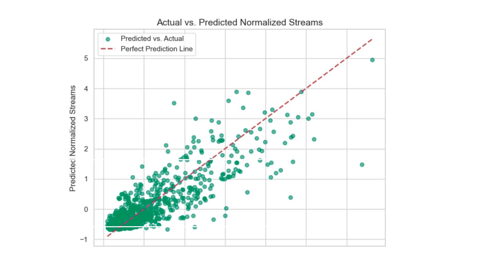

# Predicting the Next Hit
**Music Streaming · Content Performance Analysis**

## Overview
Analyzed Spotify's top songs of 2023 to identify factors most strongly associated with streaming success and inform data-driven music investment and release decisions.

> Full write-up coming soon

## Methods
- Exploratory Data Analysis
- Hypothesis Testing (t-tests, chi-square)
- Multiple Linear Regression
- K-Means Clustering
- PCA

## Key Findings
- **Playlist placement explained 72.7% of variance in streams (R²=0.727)** — Spotify placements had the largest effect (β=0.4975) vs Apple Music (β=0.37) and Deezer (β=0.12)
- **Audio features did not predict streaming performance** — danceability showed a slight negative correlation (r=−0.10) despite being common among top artists
- **Release season was significantly associated with performance tier** — top-performing songs were more concentrated in winter releases (χ²=27.92, p=.001)

## Tech Stack
Python · Pandas · Statsmodels · SciPy · Scikit-learn · Matplotlib · Seaborn

## Files
- `spotify_hit_analysis.py` — main analysis script
- `requirements.txt` — project dependencies

## Key Visual Insights

### Distribution of Streams

Top 10 artists show higher median streams but also far greater variability — success is driven by a small number of viral outliers, not consistent output.

### Playlist Impact on Streams

Streaming performance scales with playlist placements across all three platforms. Spotify placements had the strongest effect (β=0.4975) — more than 4x the influence of Deezer (β=0.12), making Spotify editorial placement the single highest-leverage distribution channel.

### Actual vs Predicted Streams

Model predictions closely track actual values (R²=0.727), with most variance concentrated in high-stream outliers — suggesting viral breakouts follow patterns the model doesn't fully capture.

### Track Clustering by Performance

K-means clustering separates tracks into four distinct tiers based on playlist exposure. The majority of tracks fall in the low-visibility cluster, with a small group of well-known and phenomenal performers pulling far ahead.

### Performance by Release Season

Well-known and phenomenal tracks are more concentrated in autumn and winter releases (χ²=27.92, p=.001), suggesting release timing meaningfully affects a track's chance of breaking through.

## How to Run
```bash
pip install -r requirements.txt
python spotify_hit_analysis.py
```

> Dataset: Top Spotify Songs 2023 — Kaggle
