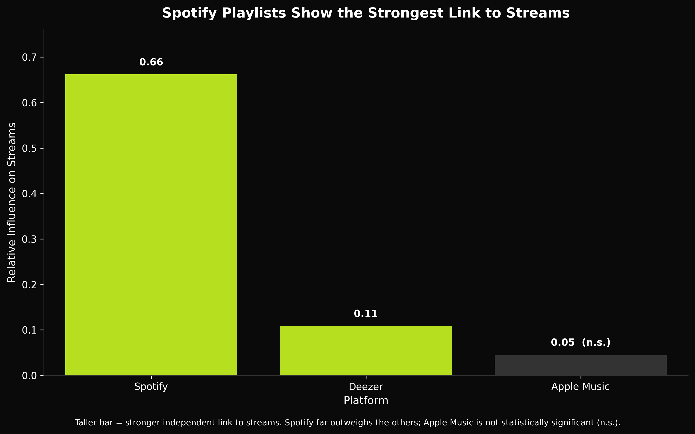
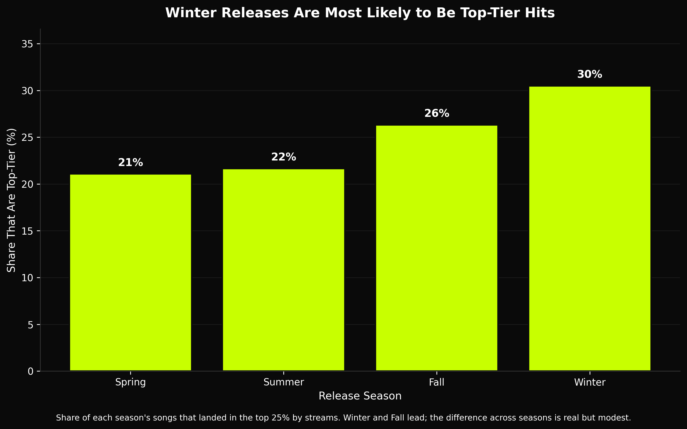
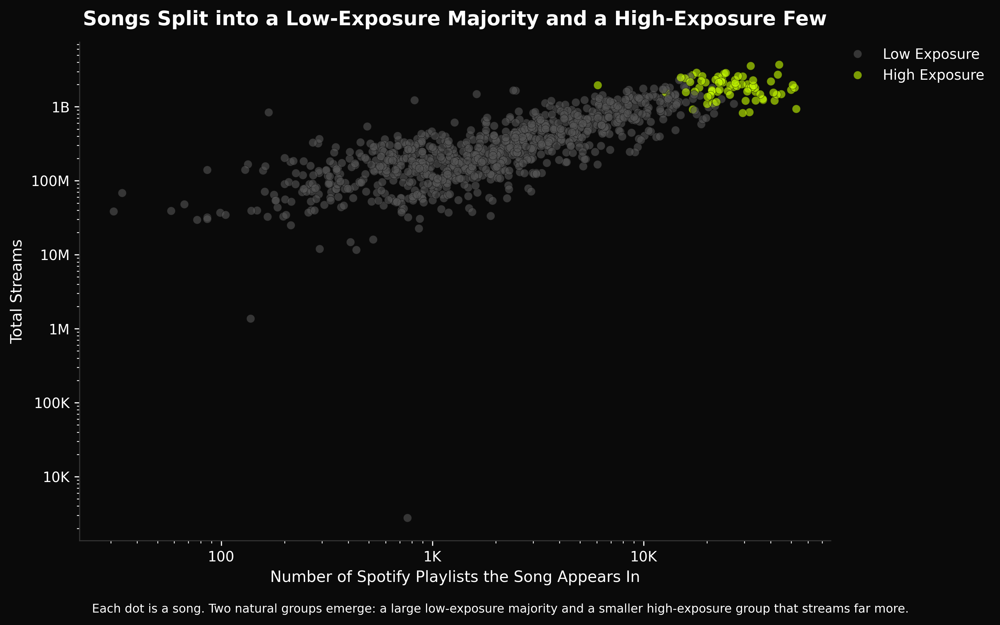
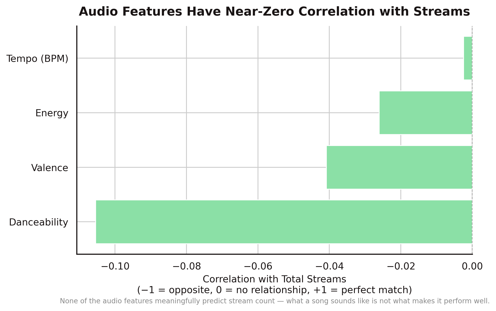

# What Actually Drives Streaming Performance?
**Multiple Linear Regression (log-log) · K-Means Clustering · PCA · 952 Songs**

---

## Overview
Playlist placement, audio features, release timing — which actually predicts whether a song performs? This project analyzed Spotify's top songs of 2023 to find out, testing variables across Spotify, Apple Music, and Deezer.
Built a full pipeline from raw CSV to regression, clustering, and hypothesis testing.

> Full write-up: https://jasminebahremand.my.canva.site/

---

## Key Findings
- **Playlist placement is the strongest driver of streaming performance**, explaining ~62.5% of variation in streams (log-log regression, R² = 0.625; train/test validated).
- **It's overwhelmingly a Spotify story.** Standardized effects: Spotify β = 0.66 (dominant, significant), Deezer β = 0.11 (small, positive), Apple Music β = 0.05 (not statistically significant).
- **Audio features do not predict performance.** They had near-zero correlation with streams, and an audio-only regression explained just ~2% of variation.
- **Release timing matters.** Release season is significantly associated with performance tier (χ² = 55.40, p < .001); winter releases over-index on the top tier (30.5% top-tier vs ~21% in spring).

---

## Key Visuals

### Spotify Playlists Have the Strongest Impact on Streams

Standardized effect of each platform's playlists. Spotify dominates; Apple's effect isn't statistically significant and Deezer's is small, so playlist impact is really a Spotify story.

### Song Performance Mix Changes Across Release Seasons

Winter releases show the highest share of top-tier songs (χ² = 55.40, p < .001) — release timing meaningfully affects a track's chance of breaking through.

### More Playlist Exposure Tracks Higher Streams

K-means segments songs into four tiers by playlist exposure and stream volume; PCA shows they blend along a continuum rather than forming sharply separated clusters.

### Audio Features Have Near-Zero Correlation with Streams

All audio features show weak-to-negligible correlations with streams — what a song sounds like is not what makes it perform well.

---

## Methods
- Exploratory data analysis and cleaning (type conversion, missing-value handling)
- Multiple linear regression (log-log) with robust standard errors (HC3) and standardized coefficients for fair platform comparison
- Train/test split and VIF checks to validate the model and rule out multicollinearity
- Audio-only regression + correlations to test whether sound predicts streams
- T-tests (top-tier vs other songs) across all audio features with a Bonferroni correction
- Chi-square test for release season vs performance tier
- K-Means clustering (k=4) with PCA to examine performance-tier structure

---

## Limitations
- **Correlation, not causation.** Playlists and streams reinforce each other (popular songs get added to more playlists), so these results show association, not proof that playlists drive streams.
- **Selection bias.** The data covers only the *top* songs of 2023, so all findings are conditional on a song already being a hit and may not generalize to all songs.
- **Observational data.** Without an experiment (e.g., randomly assigning playlist placement), platform effects can't be fully isolated.

---

## Tech Stack
Python · Pandas · Statsmodels · SciPy · Scikit-learn · Matplotlib · Seaborn

---

## How to Run
**Locally:**
```bash
pip install -r requirements.txt
jupyter notebook spotify_hit_song_analysis.ipynb
```
**Or in Google Colab:** open the notebook and run all cells — no setup needed. The notebook loads the dataset straight from this repo, so it works whether you run it locally or in the cloud.

---

## Data
**Top Spotify Songs 2023:** https://www.kaggle.com/datasets/nelgiriyewithana/top-spotify-songs-2023
The CSV (`spotify-2023.csv`) is included in this repo and loaded automatically by the notebook, so there's no separate download from Kaggle. (Original source: Kaggle, linked above.)

---

## Files
- `spotify_hit_song_analysis.ipynb` — full analysis notebook
- `spotify-2023.csv` — Spotify 2023 dataset
- `requirements.txt` — dependencies
- `plots/` — generated visualizations
